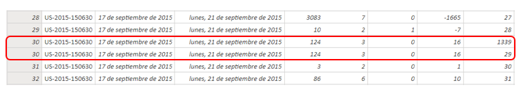
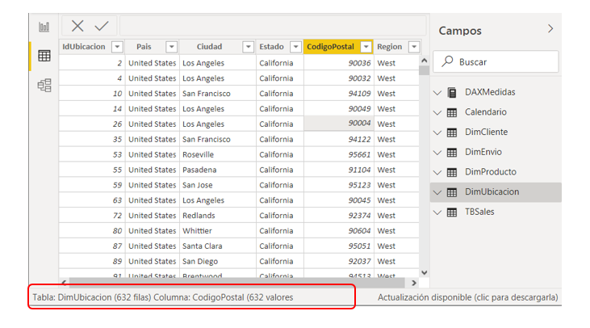

# Análisis de una solución en Power BI

Esté análisis no parte de una solución desde cero, sino que surge al intentar recrear un análisis ya hecho tomando unas rutas mas cortas. 

## Contenido:

- [Inicio y problema](#inicio-y-problema)
- [Desarrollo del problema](#desarrollo-del-problema)
- [Origen del problema](#origen-del-problema)
- [Buscando la solucion](#buscando-la-solucion)
- [Resultado final](#resultado-final)
- [Otras soluciones](#otras-soluciones)

## Inicio y problema

Tenia a la mano un dashboard que realicé gracias a un tutorial donde enseñaban el manejo de la herramienta de analisis Power Bi. Mi intención luego de acabado era recrear ese mismo dashboard pero siguiendo un camino que aminorara la cantidad de pasos.

En el tutorial se usaba un archivo base de excel con un tabla que durante el proceso de transformación era dividida en 4 dimesiones (DimPRoducto, DimCliente, DimUbicacion, DimEnvio) y una tabla de hechos (TBSales) que luego se tenian que relacionar entre si, yo pretendía recrear la solución pero sin tener que dividir la tabla.

En el nuevo archivo empecé con la creación de las 5 medidas que tenia el tutotial, partiendo de mi unica tabla TBSales sin dividir, estas fueron:

- **Ingresos**: sumatoria de la columna ***Ventas***.
- **Beneficios**: sumatoria de la columna ***Beneficios***.
- **Ordenes**: recuento de los distintos valores de la columna ***IdOrden***.
- **Clientes**: recuento de los distintos valores de la columna ***IdCliente***.
- **Unidades**: sumatoria de la columna ***Cantidad***.

Al comparar estos resultados con los del archivo del tutorial, vi que tres de las medidas no coincidian: **Ingresos**, **Beneficios** y **Unidades**

## Desarrollo del problema

Me dirigí al archivo Excel y creé una tabla dinámica para obtener la sumatoria de la columna ***Cantidad***, el resultado coincidió con la medida **Unidades** que estaba haciendo actualmente y difería de la medida **Unidades** del tutorial, probé las otras dos medidas que no coincidían con el tutorial y el resultado fue exacto con las que estaba haciendo en el nuevo archivo.

Con la tabla dinámica hice un conteo de la misma columna ***Cantidad*** y dió 9994, luego hice ese conteo en la columna ***Cantidad*** del archivo Power Bi que estaba haciendo y el resultado coincidió, después realicé lo mismo en el archivo Power Bi del tutorial y el resultado fue de 10372.El archivo Excel posee 9994 filas en total, el conteo de ***Cantidad*** en Excel y el conteo de ***Cantidad*** en el archivo nuevo dieron las mismas 9994 filas, el conteo de ***Cantidad*** en el archivo del tutorial en teoría debería tener la misma cantidad de filas, puesto que al ser una columna de la tabla de hechos no hubo ni reducción ni aumento de la misma.

Entré a la vista de Datos y al seleccionar un valor de la columna que identifica (***IdFila***) la tabla de hechos (**TBSales**), esta daba 10372 filas y 9994 valores distintos. A partir de eso intuí que algo estaba mal en el modelado del tutorial, pues la cantidad de valores distintos coincidían con el número de filas de la tabla Excel, pero de alguna forma se estaban repitiendo filas, deje el archivo nuevo y me dedique solo al del tutorial.

## Origen del problema

En la vista de datos ordené la tabla de hechos **TBSales** por ***IdFila*** que es un identificador numérico que empezaba en 1 y terminaba en 9994, encontré rápido los primeros datos duplicados, el id de fila 30 se repetía.

En algún momento del proceso de transformación de datos había ocurrido algún error. La tabla de hechos contiene las siguientes columnas originales:

- ***IdFila***: Identifica la fila de **TBSales**.
- ***IdOrden***: Identifica las órdenes de compra.
- ***FechaPedido***: Fecha de la orden de compra.
- ***Ventas***: El precio total por producto.
- ***Cantidad***: El número de unidades del producto.
- ***Beneficio***: El beneficio del producto de acuerdo al costo.

También posee 4 columnas calculadas que identifican los datos de 4 tablas que se separaron en el proceso de transformación: ***IdProducto***, ***IdCliente***, ***IdUbicacion*** y ***IdEnvio***.

En las filas de ***IdFila*** 30 que se repetían todos los campos coincidían menos el de ***IdProducto*** que daba dos valores distintos:

Me dirigí a la tabla **DimProducto** en el menú lateral de Datos y seleccioné un campo de la columna ***CodigoProducto***, el resultado fue de 1894 filas y 1862 valores distintos, es decir se estaban repitiendo códigos de productos.

Ordené la tabla por ***CodigoProducto*** y echando un vistazo a las primeras filas, vi que se repetía el código **FUR-BO-10002213**, el mismo código estaba siendo asignado para dos nombres de productos similares (ambos pertenecían a la misma categoría y subcategoría).

Entonces para ir aclarando esto se deberia retroceder un poco mas,cuando se dividió la tabla del archivo Excel, las dimensiones se crearon con los campos que se asociaban a cada dimensión, por ejemplo la tabla **DimCliente** se quedó con las columnas ***CodigoCliente***, ***NombreCliente*** y ***Segmento***, luego se eliminaron filas duplicadas y se creó un identificador numérico(***IdCliente***) para no utilizar ***CodigoCliente*** que era un valor más largo, lo mismo se hizo para las tablas **DimUbicación**, **DimEnvio** y **DimProducto**.

Ahora la tabla **DimProducto** que nos interesa se creó de la siguiente forma: Del Excel base se separaron los campos, ***CodigoProducto***, ***Categoria***, ***SubCategoria*** y ***NombreProducto*** luego se eliminaron duplicados y se creó un índice (***IdProducto***) asociado al código.

Era evidente que había códigos que tenían más de un nombre de producto y al crearles un identificador se tomaban como productos diferentes, lo que hacía que la cantidad, las ventas y los beneficios se repitieran en esos códigos y al sumarlos o contarlos de la tabla **TBSales** se obtuviese montos mayores a los verdaderos. Ese era el origen del problema.

## Buscando la solucion

Para solucionar el problema decidí modificar la transformación de la tabla **DimProducto**, Desde Power Query y en el paso 7 del archivo del tutorial se deseleccionó el nombre del producto y se dejó que se eliminen duplicados basándose solo en las columnas ***CodigoProducto***, ***Categoria*** y ***Subcategoria***.

Al regresar a la tabla **DimProducto** en la vista de Datos y seleccionar un campo de la columna ***CodigoProducto***, este nos arroja 1862 filas y 1862 valores distintos, lo que indica que ya no se están repitiendo columnas.

Sin embargo, al ir a la vista de Informe tenemos que los datos han variado, sí, pero aún no son iguales a los del archivo que se estaba haciendo por separado.

Tomando en cuenta el error anterior se buscó si este se estaba repitiendo en las demás tablas que fueron creadas, en la vista de Datos se revisó la tabla **DimEnvio**, que contaba con 4 filas y 4 valores distintos, se revisó la tabla **DimCliente**, en donde tanto al seleccionar el ***IdCliente*** como el ***CodigoCliente*** se obtuvieron 793 filas con 793 valores distintos.

Finalmente, al revisar la tabla **DimUbicación** y seleccionar un campo de la columna ***CodigoPostal***, este nos dio 632 filas y 631 valores distintos, es decir se estaba repitiendo un código postal.

## Resultado final

En el archivo de Excel se creó una tabla dinámica con la opción de “Agregar estos datos al modelo de datos” marcada. Luego se colocó el campo ***CodigoPostal*** en Filas y ***Ciudad*** en Valores, se cambió el recuento normal de ciudad por “recuento distinto”. Un código postal debía hacer referencia a una única ciudad y la mayoría de los recuentos deberían dar 1, pero había uno que tenía que dar 2. Se ordeno la columna de recuento distinto de ciudad de mayor a menor y en la primera fila nos salió el código postal que hacía referencia  dos ciudades: 92024.

Se agrego la columna ***Ciudad*** a las filas y las dos ciudades eran San Diego y Encinitas:

Se hizo una búsqueda rápida en Google y San Diego tenía varios códigos postales, pero ninguno el 92024, así que se decidió cambiar 34 filas del Excel que tenían ese código por el 92027.

Con ese cambio ahora en la tabla **DimUbicacion** nos daba 632 filas con 632 columnas distintas al selecciona un valor de la columna ***CodigoPostal***.

Y en la vista de datos los valores de las medidas que salían distintos finalmente coinciden y son los verdaderos dando por finalizada la correción del archivo del tutorial.

El resultado final quedo asi:

## Otras soluciones

- Finalmente despues de corregir el archivo del [tutorial](Power%20BI%20tutorial), procedi con terminar mi [solucion](Power%20BI%20sin%20dividir%20tabla) en donde quitaba la division de la tabla excel, y luego de eso repliqué la misma solucion trabajando unicamente en el archivo de [excel](Dashboard%20en%20excel) sin utilizar Power Bi.